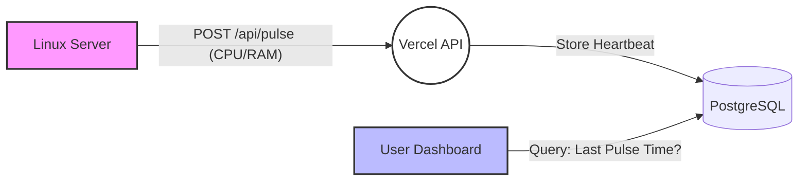

_From the product series "Stellar Guide"_

# Quasar 💫

**Quasar** is a lightweight, push-based server monitoring solution designed to run indefinitely at zero cost. It solves the problem of monitoring private servers (without static IPs) using serverless frontends (like Vercel) that cannot maintain persistent connections.

---

## 💡 The Concept: "Accidental" Telemetry

Most monitoring systems use a **Pull Model** (The dashboard asks: _"Are you alive?"_).
However, this requires the dashboard to be "always on" and the server to be publicly reachable.

**The Challenge:**
I wanted to monitor my home Linux server using a **Vercel** dashboard.

- **Constraint 1:** Vercel functions "sleep" and cannot run background cron jobs to ping my server.
- **Constraint 2:** My server didn't have a static IP or open ports.

**The Solution:**
I inverted the model. Quasar is a **Push-based** system.

1.  **The Agent:** A simple Linux service runs on the server.
2.  **The Pulse:** Every 3 minutes, it gathers vital stats (CPU, RAM, Docker container status) and `POST`s them to Vercel.
3.  **The Observer:** The Vercel dashboard saves this to PostgreSQL.
4.  **The Logic:** If the dashboard hasn't received a "pulse" in >5 minutes, it declares the server **Dead**.

_Essentially, I accidentally re-invented MQTT/IoT telemetry patterns to solve a budget constraint._

---

## ⚙️ Architecture

