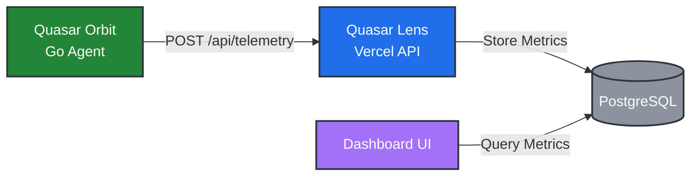

_From the series "Stellar Guide"_

# Quasar 💫

**Quasar** is a lightweight, push-based server monitoring solution designed to run indefinitely at zero cost. It solves the problem of monitoring private servers (without static IPs) using serverless frontends (like Vercel) that cannot maintain persistent connections.

---

## 💡 The Concept: "Accidental" Telemetry

Most monitoring systems use a **Pull Model** (The dashboard asks: _"Are you alive?"_).
However, this requires the dashboard to be "always on" and the server to be publicly reachable.

**The Challenge:**
I wanted to monitor my home Linux server using a **Vercel** dashboard with zero cost, has high availability, and past data visualization to help me understand the crash.

- **Constraint 1:** Vercel functions "sleep" and cannot run background cron jobs to ping my server (Vercel does have CRON, but it can't maintain a state, run Tailscale to actually ping my server).
- **Constraint 2:** My server didn't have a static IP or open ports.

**The Solution:**
I inverted the model. Quasar is a **Push-based** system.

1.  **Quasar Orbit (Agent):** A Go service runs on the server, collecting system metrics.
2.  **The Pulse:** Every 3 minutes, it gathers vital stats (CPU, RAM, Disk, Swap) and `POST`s them to Vercel.
3.  **Quasar Lens (Observer):** The Vercel dashboard receives and stores telemetry in PostgreSQL.
4.  **The Logic:** If the dashboard hasn't received a "pulse" in >5 minutes, it declares the server **Dead**.

_Essentially, I accidentally re-invented MQTT/IoT telemetry patterns to solve a budget constraint._

---

## 🏗️ Project Structure

```
quasar/
├── quasar_orbit/      # Go monitoring agent (runs on server)
│   ├── main.go        # CLI interface and output handling
│   ├── collector.go   # Metrics collection using gopsutil
│   └── go.mod
│
└── quasar_lens/       # Next.js dashboard (Vercel)
    ├── prisma/        # Database schema
    ├── app/           # Next.js app router
    └── package.json
```

---

## ⚙️ Architecture



---

## 🚀 Quick Start

### Quasar Orbit (Server Agent)

**Automated Installation (Linux):**

Install and configure as a systemd service in 3 commands:

```bash
# Download installer (auto-downloads binary from GitHub)
curl -O https://raw.githubusercontent.com/mahou-anisphia/quasar/main/quasar_orbit/install.sh
chmod +x install.sh

# Run installer - prompts for server name, endpoint, interval, etc.
sudo ./install.sh
```

The installer will:

- Auto-detect your architecture (x86_64 or i386)
- Download the appropriate binary from GitHub releases
- Configure systemd service with your settings
- Start monitoring automatically

**Manual Installation:**

Download pre-built binaries from [GitHub Releases](https://github.com/mahou-anisphia/quasar/releases) or build from source:

```bash
cd quasar_orbit

# Build using the build script (outputs to build/ directory)
./build.ps1

# Or build manually for your platform
go build -o quasar_orbit

# Test it
./quasar_orbit --name "MyServer"
```

**Usage Examples:**

```bash
# Send to Vercel endpoint
./quasar_orbit --name "MyServer" \
  --output http \
  --url1 "https://your-app.vercel.app/api/telemetry" \
  --header1 "Authorization:Bearer YOUR_TOKEN"

# With manual hardware specs (fallbacks)
./quasar_orbit --name "MyServer" \
  --cpu 8 \
  --ramsticks 2 \
  --drives 3 \
  --output http \
  --url1 "https://your-app.vercel.app/api/telemetry"
```

See [quasar_orbit/README.md](quasar_orbit/README.md) for detailed documentation.

### Quasar Lens (Dashboard)

See [quasar_lens/README.md](quasar_lens/README.md) for setup instructions.

---

## 📊 Telemetry Metrics

### Tier 1 (Critical)

- `diskUsagePercentage` - Disk usage across all drives
- `uptime` - Seconds since boot (detect reboots)
- `attemptNo` - Heartbeat sequence number

### Tier 2 (Core Monitoring)

- `cpuUsagePercentage` - CPU utilization (1-second average)
- `ramUsagePercentage` - RAM usage percentage
- `swapUsedBytes` - Swap memory used in bytes

### Tier 3 (Future)

- Disk I/O metrics
- Network throughput & latency
- Per-core CPU usage
- Temperature monitoring
- Docker container stats

---

## 🛠️ Technology Stack

**Quasar Orbit:**

- Go 1.25
- [gopsutil/v4](https://github.com/shirou/gopsutil) - Cross-platform system metrics
- Native HTTP client

**Quasar Lens:**

- Next.js 15 (App Router)
- Prisma ORM
- PostgreSQL (via Vercel)
- TypeScript

---

## 🎯 Design Principles

1. **Zero Cost**: Runs on free tiers (Vercel, free PostgreSQL)
2. **Cross-Platform**: Develop on Windows, deploy on Linux (gopsutil abstracts OS differences)
3. **Push-Based**: Server initiates contact (no firewall/NAT issues)
4. **Resilient**: CLI fallbacks if syscalls fail, graceful error handling
5. **Minimal Dependencies**: Single binary agent, serverless dashboard
6. **Easy Deployment**: Automated installer with GitHub releases - from download to monitoring in under 2 minutes

---

## 📝 Final Words: The Origin Story

I first built this in 2 hours back in 2024 when I got my first server but couldn't afford monitoring tools. It was crude—no dashboard, no concept, just a working hack.

1 year later, after time in management, I realized I'd lost touch with this kind of hands-on problem-solving. Quasar is my return to first-principles engineering: taking something I once hacked together and rebuilding it with proper architecture, clear concepts, and production quality.

The irony: the "ivory tower" made me rusty at the very skills that got me there.

_Quasar project is under MIT License_
